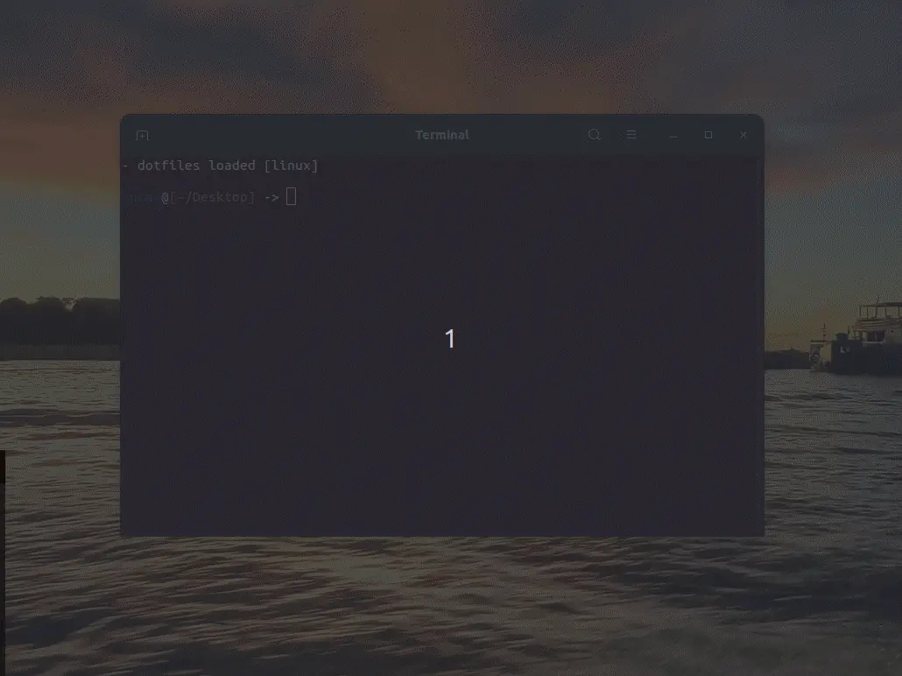

<a name="TOC"></a>

<h3 align="center">
  REPOSITORIES MANAGER
</h3>

<div align="center">
  <a href="https://www.npmjs.com/package/repositories_manager"></a>
  <a href="https://nodejs.org/en/"></a>
  <a href="https://github.com/lucasvtiradentes/repositories_manager#contributing"></a>
</div>

<p align="center">
  <a href="#dart-features">Features</a> • <a href="#warning-requirements">Requirements</a> • <a href="#bulb-usage">Usage</a> • <a href="#wrench-development">Development</a> • <a href="#books-about">About</a>
</p>

<a href="#"></a>

## :trumpet: Overview

<div align="center">sync and manage your git repositories effortlessly</div><br />

<div align="center">
  
</div>

<div align="center">
  <details>
    <summary>main execution flow</summary>
    
  </details>
</div>

<div align="center">
  <details>
    <summary>available options flow</summary>
    
  </details>
</div>

## :question: Motivation

My primary motivation for developing this tool was to ensure that all my repositories are set up the way I want, everywhere, with minimal effort. A good example is being able to have all my repos in place for me after formatting my PC or setting up a new VPS instance.

## :dart: Features<a href="#TOC"></a>

&nbsp;&nbsp;&nbsp;✔️ manage all your repositories with a simple [configs.json](./examples/configs.jsonc) file (which follows [this schema](./src/consts/schema.ts)).<br>
&nbsp;&nbsp;&nbsp;✔️ shows a terminal menu to select option to perform;<br>
&nbsp;&nbsp;&nbsp;✔️ clone missing repositories into local machine;<br>
&nbsp;&nbsp;&nbsp;✔️ delete existing repositories that should not be present on the local machine;/<br>
&nbsp;&nbsp;&nbsp;✔️ quickly open a repository on your code editor by selecting from a list;<br>
&nbsp;&nbsp;&nbsp;✔️ quickly open a repository link on your browser by selecting from a list;<br>
&nbsp;&nbsp;&nbsp;✔️ works for windows, linux and mac.<br>

## :warning: Requirements<a href="#TOC"></a>

In order to use this project in your computer, you need to have the following items:

- [nodejs](https://nodejs.org/en/): To actually run the package;
- [npm](https://www.npmjs.com/): To install the package. Npm is installed alongside nodejs;
- [git](https://git-scm.com): To clone the repositories.

## :bulb: Usage<a href="#TOC"></a>


To setup this project in your computer, download it in this link or run the following commands:

```bash
# install the package
$ npm install repositories_manager -g

# setup the package with your configs (on linux and mac)
$ rp -s "/path/to/your_configs_file.json"

# setup the package with your configs (on windows)
$ rp -s "C:\\users\\lucas\\path\\to\\your_configs_file.json"

# tip: you can use it on your terminal as: rp, rpm or repositories_manager
```

After setup the repositories_manager with your configs, you can use the following options:

```bash
Usage: repositories_manager [options]

🔄 sync and manage your git repositories effortlessly.

Options:
  -V, --version          output the version number
  -s, --setup <file>     setup your repositories configs file path
  -r, --remove           remove the repositories configs file
  -p, --pull_repos       clone missing repositories locally
  -pg, --purge_repos     purge repositories that should not exist locally
  -or, --open_repo       select repository to open on your editor
  -ol, --open_repo_link  select repository to open the link on your
  -uc, --update_configs  update configs based on local repositories
  -oc, --open_configs    open the configs file
  -h, --help             display help for command
```

or, if your prefer (as I do), simply run `rp` on your terminal and you can select the option you want!

## :wrench: Development<a href="#TOC"></a>

### Development setup

To setup this project in your computer, download it in this link or run the following commands:

```bash
# Clone this repository
$ git clone https://github.com/lucasvtiradentes/repositories_manager

# Go into the repository
$ cd repositories_manager
```

After download it, go to the project folder and run these commands:

```bash
# Install dependencies using npm
$ npm install

# Run the typescript code in development mode
$ npm run dev
```

If you want to contribute to the project, after you make the necessary changes, run these commands to check if everything is working fine:

```bash
# Compile the code into javascript
$ npm run build

# Run the compiled code in production mode
$ npm run start
```

### Used technologies

This project uses the following thechnologies:

<div align="center">
  <table>
    <tr>
      <th>Scope</th>
      <th>Subject</th>
      <th>Technologies</th>
    </tr>
    <tr>
      <td rowspan="1">Project</td>
      <td>Main</td>
      <td align="center">
        <a href="https://nodejs.org/"></a>
        <a target="_blank" href="https://www.typescriptlang.org/"></a>
      </td>
    </tr>
    <tr>
      <td rowspan="3">Setup</td>
      <td>Code linting</td>
      <td align="center">
        <a href="https://github.com/prettier/prettier"></a>
        <a href="https://github.com/eslint/eslint"></a>
      </td>
    </tr>
    <tr>
      <!-- <td rowspan="3">Setup</td> -->
      <td>Commit linting</td>
      <td align="center">
      <a target="_blank" href="https://github.com/conventional-changelog/commitlint"></a>
      <a target="_blank" href="https://github.com/commitizen/cz-cli"></a>
      <!-- <a href="https://gitmoji.dev"></a> -->
      </td>
    </tr>
    <tr>
      <!-- <td rowspan="1">Setup</td> -->
      <td>Other</td>
      <td align="center">
        <a href="https://editorconfig.org/"></a>
        <a target="_blank" href="https://github.com/typicode/husky"></a>
        <!-- <a target="_blank" href="https://github.com/okonet/lint-staged"></a> -->
      </td>
    </tr>
  </table>
</div>

<a href="#"></a>

## :books: About<a href="#TOC"></a>

## License

This project is distributed under the terms of the MIT License Version 2.0. A complete version of the license is available in the [LICENSE](LICENSE) file in this repository. Any contribution made to this project will be licensed under the MIT License Version 2.0.

<a href="#"></a>

<div align="center">
  <p>
    <a target="_blank" href="https://www.linkedin.com/in/lucasvtiradentes/"></a>
    <a target="_blank" href="mailto:lucasvtiradentes@gmail.com"></a>
    <a target="_blank" href="https://discord.com/users/262326726892191744"></a>
    <a target="_blank" href="https://github.com/lucasvtiradentes/"></a>
  </p>
  <p>Made with ❤️ by <strong>Lucas Vieira</strong></p>
  <p>👉 See also all <a href="https://github.com/lucasvtiradentes/lucasvtiradentes/blob/master/portfolio/PROJECTS.md#TOC">my projects</a></p>
  <p>👉 See also all <a href="https://github.com/lucasvtiradentes/my-tutorials#readme">my articles</a></p>
</div>