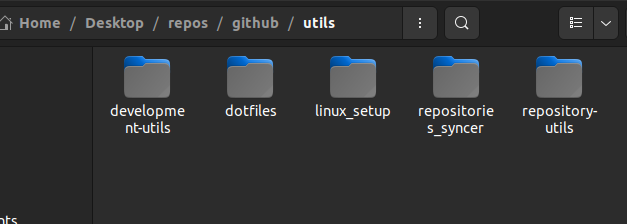

<a name="TOC"></a>

<h3 align="center">
  REPOSITORIES SYNCER
</h3>

<a href="#"></a>

## :trumpet: Overview

Effortlessly sync my personal and work repositories on a fresh [Ubuntu](https://ubuntu.com) based instance.

<div align="center">
  <table>
    <tr>
      <th>
        <a href="#"></a>
      </th>
      <th>
        <a href="#"></a>
      </th>
    </tr>
  </table>
</div>

## :dart: Features<a href="#TOC"></a>

&nbsp;&nbsp;&nbsp;✔️ shows a terminal menu to select option to perform;<br>
&nbsp;&nbsp;&nbsp;✔️ clone repositories on each [specified](./src/configs/categories.ts) category folder;<br>
&nbsp;&nbsp;&nbsp;✔️ delete existant repositories that are not on the [configs file](./src/configs/repositories.ts);<br>
&nbsp;&nbsp;&nbsp;✔️ simple way to adjust which repo will be synced, by editing the [configs file](./src/configs/repositories.ts).<br>

## :warning: Requirements<a href="#TOC"></a>

In order to use this project in your computer, you need to have the following items:

- [npm](https://www.npmjs.com/): To install the package. Npm is installed alongside nodejs;
- [nodejs](https://nodejs.org/en/): To actually run the package.

## :bulb: Usage<a href="#TOC"></a>


To setup this project in your computer, download it in this link or run the following commands:

```bash
# Clone this repository
$ git clone https://github.com/lucasvtiradentes/repositories_utils

# Go into the repository
$ cd repositories_utils
```

After download it, go to the project folder and run these commands:

```bash
# Install dependencies using npm
$ npm install

# Run the typescript code in development mode
$ npm run dev
```

<a href="#"></a>

<div align="center">
  <p>
    <a target="_blank" href="https://www.linkedin.com/in/lucasvtiradentes/"></a>
    <a target="_blank" href="mailto:lucasvtiradentes@gmail.com"></a>
    <a target="_blank" href="https://discord.com/users/262326726892191744"></a>
    <a target="_blank" href="https://github.com/lucasvtiradentes/"></a>
  </p>
  <p>Made with ❤️ by <strong>Lucas Vieira</strong></p>
  <p>👉 See also all <a href="https://github.com/lucasvtiradentes/lucasvtiradentes/blob/master/portfolio/PROJECTS.md#TOC">my projects</a></p>
  <p>👉 See also all <a href="https://github.com/lucasvtiradentes/my-tutorials#readme">my articles</a></p>
</div>